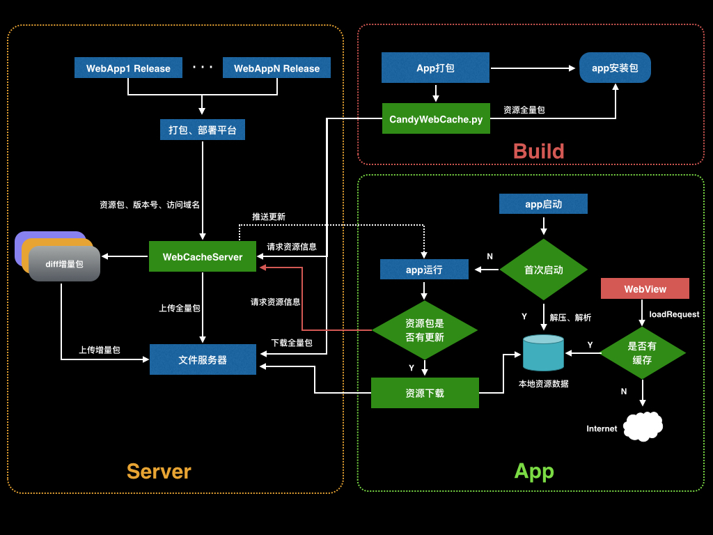
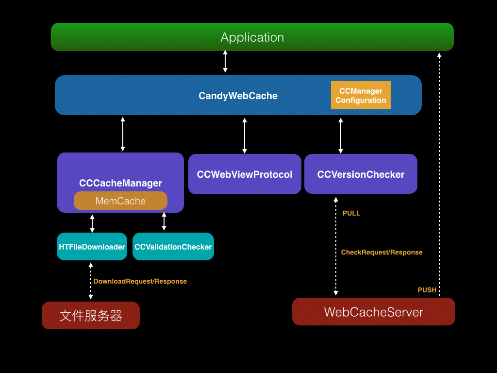

# CandyWebCache移动端WebView静态资源缓存方案的设计与实现

WebView存在问题：

* WebView首次加载静态资源需要走网络请求，受网络状态影响大
* WebView自身缓存受到HTTP协议+WebView本身控制，应用本身控制力不足
* 缓存的较大页面资源受限于缓存容量大小，可能会被WebView删除掉
* HTML5离线应用Manifest(AppCache)只支持全量更新，单个html页面只能支持单个manifest文件

CandyWebCache是移动端web资源的本地缓存的解决方案，能够拦截webview的请求，并优先使用本地缓存静态资源进行响应，以此来对webview加载页面性能进行优化。

CandyWebCache的优点

* 请求响应加速，无网络响应，节省流量
* 协议层拦截请求，客户端透明无感知
* 静态资源版本控制及更新策略
* 资源防篡改
* 静态资源自动打包到应用，及首次安装解压处理

# CandyWebCache的设计

## 整体架构图

#### Server端

1. webapp开发完成，通过打包工具和部署平台发布，将webapp的全量压缩包上传到WebCacheServer。
2. WebCacheServer收到全量压缩包，与历史若干个（可配置）版本全量压缩包做diff，得到若干个增量更新包。
3. 将全量压缩包，及若干增量更新包上传到文件服务器，得到这些资源包在文件服务器地址。客户端更新请求中会携带webapp本地版本号，WebCacheServer根据请求中的本地版本号，返回相应的增量更新包地址，以及全量包地址。

#### 客户端打包

1. 客户端打包时，通过脚本从线上获取webapp最新全量压缩包，随app一起打包发布。

#### 客户端

1. 客户端启动，判断如果是首次启动，则解压webapp资源包，解析webapp信息到本地。
2. app运行期间，可以在合适的时间（如应用启动，应用从后台切换到前台，定时器轮询），进行资源更新检查。另外，可以为WebCacheServer配置推送通道或者利用应用服务器推送通道，通知app客户端有资源更新，客户端进行资源更新检查。
3. 通过资源更新检查接口获取到资源更新地址，下载并解压到本地资源缓存。
4. 当客户端WebView发出加载请求，CandyWebCache从协议层拦截请求，根据匹配规则判断本地是否有资源缓存，如果本地资源数据中有请求url对应的资源，则返回资源数据，否则，正常走网络请求。

## 客户端架构图

#### CandyWebCache

CandyWebCache是提供给使用者的最上层访问对象，主要能力包括:

* 资源监测更新接口
* 配置资源更新策略
* 设置资源更新观察者

#### CCCacheManager

CCCacheManager负责对缓存资源进行管理，主要能力包括：

* 资源的下载与更新（增量或全量）
* 资源包的完整性校验、增量包合并与解压
* 资源的内存缓存与磁盘缓存
* url解析与缓存命中

#### CCWebViewProtocol

CCWebViewProtocol负责对http请求进行拦截，通过CandyWebCache向CCCacheManager请求缓存资源。

#### CCVersionChecker

CCVersionChecker提供webapp版本检测接口，向服务器请求资源更新的增量包或全量包地址。

# CandyWebCache客户端SDK对服务器的要求

提供给客户端SDK的接口：

* 版本检测接口，返回信息包括
	* 请求的webapp对应的增量包和全量包信息：版本号、下载地址、md5、url、domains
	* 请求中不包含的webapp则返回全量包信息：版本号、下载地址、md5、url、domains

提供给应用服务器的接口：

* 更新全量包
	* 根据全量包和历史N(N可配置)个版本的包进行diff包计算
	* 计算各个资源包的md5，并加密md5值
	* 上传增量包和全量包到文件服务，并记录各个包的md5、资源url、版本号信息、domains

服务端功能要求：

* 计算资源包diff包（使用bsdiff）
* 上传资源到文件服务器
* 资源md5计算与加密（加密算法:DES + base64）
* webapp domains的配置

# CandyWebCache客户端SDK对打包方式的要求

* 打包资源包目录路径要跟url能够对应，如http://m.kaola.com/public/r/js/core_57384232.js，资源的存放路径需要是public/r/js/core_57384232.js或者r/js/core_57384232.js
* 资源缓存不支持带“?”的url，如果有版本号信息需要打到文件名中。对于为了解决缓存问题所采用的后缀形式url，如“http://m.kaola.com/public/r/js/core.js?v=57384232”,需要调整打包方式，采用文件名来区分版本号

# 性能测试数据

* CandyWebCache带来的性能优化

开始请求页面到页面DOM树解析完成(domInteractive)用时，单位:毫秒(ms)

iPhone6s,iOS9.3

|网络环境|走网络请求|走CandyWebCache|性能提升|
|:--:|:--:|:--:|:--:|
|2g|6650|491|92.62%|
|3g|3315|1043|68.54%|
|4g|1326|677|48.85%|
|wifi|790|421|46.71%|

Galaxy Nexus,Android 4.2.2

|网络环境|走网络请求|走CandyWebCache|性能提升|
|:--:|:--:|:--:|:--:|
|2g|13847|1061|92.3%|
|3g|3457|1451|58.0%|
|4g|1147|794|30.8%|
|wifi|1005|792|21.2%|

* CacheManager内存缓存带来的性能提升

iphone5s，iOS9.3.2测试数据，单位：微秒

|文件大小(字节)|文件IO读取|内存读取|
|:--:|:--:|:--:|
|14k|105|45|
|392k|1789|51|

