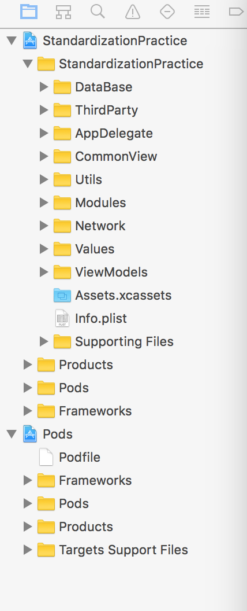
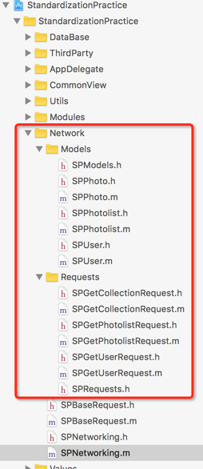
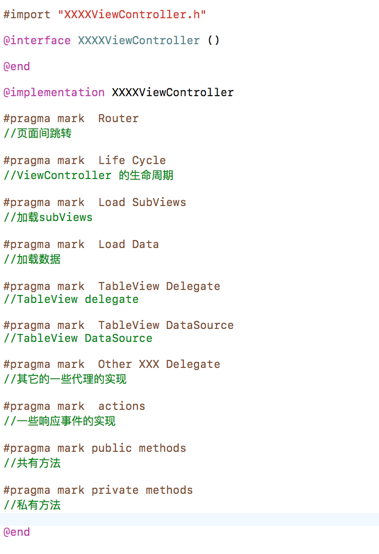

# 移动标准化demo项目总结

如果你是一个iOS开发新人，或者没有自己独立的从头到尾的做过一款完整的app的话，或者说你所在的整个团队没有非常好的积累，那么当你面对一个新的app开工的时候，往往会手足无措，不知道从何下手。而你的老板又需要你能够做到快速的敏捷开发并且保质保量。这个时候，你是否会感到比较迷茫？

通常来说，一个新的app的架构上，往往需要考虑一下几个方面的问题:

1. 如何设计整改app的架构，项目的工程配置应该如何配置
2. 开源库的选择，如何能在众多的开源库里面选择出稳定而高效的第三方库
3. 如何能避免一个重复的劳动，从而提高开发效率
4. 团队成员之间的协作，如何制定好开发的规范，减少沟通损耗，降低维护成本

网易通过其多款精致app的开发经验，提出了移动开发标准化方案，专注于解决以上的问题，为你的app之路保驾护航～

通过我们接下来的一个标准化的demo小项目，我们将尽量完全重现一款新的app从架构设计到具体业务开发的完整流程，希望能对你有所帮助。

### chapter 1 开发规范
首先在开发之前，我们需要明确一下规范: __标准化项目的团队开发规范__。 详见[标准化大纲](https://g.hz.netease.com/mobile-ios/Standardization/wikis/home)中的 __团队开发规范__。
__团队开发规范__大致由以下几个部分组成:

1. 代码规范: [Obejective-C编码规范](https://g.hz.netease.com/mobile-ios/Standardization/blob/master/DevelopSpecifications-Docs/Objective-C%E7%BC%96%E7%A0%81%E8%A7%84%E8%8C%83.md) / [Swift编码规范](https://g.hz.netease.com/mobile-ios/Standardization/blob/master/DevelopSpecifications-Docs/Swift%E7%BC%96%E7%A0%81%E8%A7%84%E8%8C%83.md)
2. 团队协作规范:  [git规范](https://g.hz.netease.com/mobile-ios/Standardization/blob/master/DevelopSpecifications-Docs/Git%E4%BD%BF%E7%94%A8%E8%A7%84%E8%8C%83.md) 
3. 工程规范: [项目工程组织规范](https://g.hz.netease.com/mobile-ios/Standardization/blob/master/DevelopSpecifications-Docs/%E9%A1%B9%E7%9B%AE%E5%B7%A5%E7%A8%8B%E7%BB%84%E7%BB%87%E8%A7%84%E8%8C%83.md) 
4. 页面编写规范:[项目页面编写规范-自定义View](https://g.hz.netease.com/mobile-ios/Standardization/blob/master/DevelopSpecifications-Docs/%E9%A1%B9%E7%9B%AE%E9%A1%B5%E9%9D%A2%E7%BC%96%E5%86%99%E8%A7%84%E8%8C%83-%E8%87%AA%E5%AE%9A%E4%B9%89View.md) / [项目页面编写规范-静态TableVIew](https://g.hz.netease.com/mobile-ios/Standardization/blob/master/DevelopSpecifications-Docs/%E9%A1%B9%E7%9B%AE%E9%A1%B5%E9%9D%A2%E7%BC%96%E5%86%99%E8%A7%84%E8%8C%83-%E9%9D%99%E6%80%81TableView.md)
5. 文档规范: [MarkDown编写规范](https://g.hz.netease.com/mobile-ios/Standardization/blob/master/DevelopSpecifications-Docs/%E5%85%AC%E5%8F%B8Git-Markdown%E8%AF%AD%E6%B3%95%E8%A7%84%E8%8C%83.md) ／ [README编写规范](https://g.hz.netease.com/mobile-ios/Standardization/blob/master/DevelopSpecifications-Docs/SDK-README%E7%BC%96%E5%86%99%E8%A7%84%E8%8C%83.md) 


### chapter 2 创建工程
了解了团队开发规范之后，我们需要创建好整个项目工程，确定好整个项目工程的工程配置，目录组织结构等等。通常这个过程是个比较琐碎而繁杂的过程。 然后有了标准化，一切都将不在是烦恼，通过标准化中的[HTTemplate](https://g.hz.netease.com/HeartTouchOpen/HTTemplate), 我们可以做到通过脚本和模版（多种模版可供选择），快速的搭建应用，一键完成以下所有的功能:

```
1. 提供默认的工程目录组织结构
2. 提供默认的底部栏实现
3. 提供不同模式下的Xcconfig
4. 提供默认的Podfile文件，导入HTUI库、HTNetworking库以及关联的第三方库
```

HTTemplate的详细介绍和使用方法请自行查看[HTTemplate](https://g.hz.netease.com/HeartTouchOpen/HTTemplate)

### chapter 3 工程结构
一个好的项目的工程结构应该是非常清晰明了的，不同的模块，功能，工具分别放在事先划分好的一个目录结构里面，可以让团队内所有人都能迅速的找到对应的代码。

我们demo工程目录结构大致如下图：


其中每个目录结构的功能划分和解释如下：

```
1. DataBase: 默认的数据库模块，demo中采用FMDB
2. AppDelegate: 默认的AppDelegate,初始化tab页
3. CommonView: 一些工程中时常使用到的View，例如：加载页、空白页、上拉加载控件、下拉刷新控件等等
4. Util: 工具类信息，提供NSString+NOS的分类，ViewController的Loading分类，导航栏处理分类以及默认的WebViewController等等
5. Modules: 根据业务分成不同的模块，如demo中，就分成了Login(登陆)／Main(基础页面)／Mine(我的)／Publish(发布)／Search(搜索)/Square(广场)
6. Network: 存放与网络相关的文件，利用NEI平台生成的model文件也会存放在这里。默认的Networking提供初始化的网络配置以及三种网络状态，测试服（dev）、预发布服(pre)、线上服(online)
7. Values: 提供默认的color以及size信息，并且提供处理屏幕适配和抗锯齿的处理函数
8. ViewModels: model数据的进一步处理，更进一步给页面展示提供服务
9. Pods: cocoaPods相关，目前demo项目里面引入了第三方库，包括标准化内的二方库（HT开头的那些），以及一些比较常用的三方库(AFNetworking)/(Masonry)/(ReactiveCocoa)等等
```

对项目工程目录更细化的介绍，详见[项目工程组织规范](https://g.hz.netease.com/mobile-ios/Standardization/blob/master/DevelopSpecifications-Docs/%E9%A1%B9%E7%9B%AE%E5%B7%A5%E7%A8%8B%E7%BB%84%E7%BB%87%E8%A7%84%E8%8C%83.md)

### chapter 4  网络库
网络库的选择，对于一个app也是至关重要的。标准化项目中有网易自己定制的网络库：[HTNetworking](https://g.hz.netease.com/mobile-ios/Standardization/wikis/htnetwork-htnetworking)

HTNetworking是一个基于RestKit开发的iOS网络框架库，具有使用简单、高度可配置、扩展性强等特点，同时集成了cache等高级功能。其具有以下优点：

```
1. 简单清晰的请求描述，高度可配置;
2. 提供Mock数据测试功能，无须服务器支持也能走通网络请求逻辑;
3. 强大的对象映射系统，网络请求返回数据与数据模型类(Model)自动映射;
4. 良好的扩展性，更方便替换与扩展底层网络请求库;
5. 集成cache、冻结请求、请求调度;
6. 解除RestKit与AFNetworking的耦合；
```

除了以上优点之外，[HTNetworking](https://g.hz.netease.com/mobile-ios/Standardization/wikis/htnetwork-htnetworking)还有一个非常重要的优点，就是它可以和[NEI](https://g.hz.netease.com/mobile-ios/Standardization/wikis/htnetwork-nei)完美结合，从而达到网络数据业务层的Request请求以及Response的Model的代码一键自动生成。从而避免了开发者自己手写Request／Model的重复性劳动，同时也避免了手写过程中有可能造成的人工错误。

[NEI](https://g.hz.netease.com/mobile-ios/Standardization/wikis/htnetwork-nei)是网易杭州研究院前端技术部提供的用于优化前后端接口的开发和测试的工作的一个非常好用的工具，它可以在上面定义请求的异步接口与数据类型，并协助自动生成客户端的请求代码已经model的数据结构。同时还能根据工程模版自动化生成项目工程。详见：[NEI](https://nei.netease.com) / [NEI mobile新版本使用指南](https://g.hz.netease.com/HeartTouchOpen/nei_mobile/blob/dev/Version3.0/How-To-Use/nei%20mobile%E6%96%B0%E7%89%88%E6%9C%AC%E4%BD%BF%E7%94%A8%E6%8C%87%E5%8D%97.md)

在我们的demo工程中，Network目录下面绝大部分的代码，都是由NEI自动生成的，简洁明了。

见下图红框部分



### chapter 5 页面结构
良好的页面结构规范对整个页面逻辑的梳理有很大的作用，通过#pragma mark 宏，我们将一般的页面分成以下大致几个模块



同时为了减少一些通用的页面逻辑的冗余代码，增强复用性和扩展性。viewcontroller的一步功能会用类别的方式来实现，例如demo中的navigationBar的样式（由<font color=blue>UIViewController+SPNavigationBar.h</font>来实现），页面的加载页，空白页，错误页等逻辑（由<font color=blue>UIView+SPLoading.h</font>来实现）

具体的页面实际的例子可以参考demo中的任意ViewController。

### chapter 6 页面跳转
关于不同ViewController之间的跳转的模式以及参数的传递，建议使用[HTUniversalRouter](https://g.hz.netease.com/mobile-ios/Standardization/wikis/htui-htrouter)

[HTUniversalRouter](https://g.hz.netease.com/mobile-ios/Standardization/wikis/htui-htrouter) 使用URL来定位页面及页面导航。有以下优点：

```
1. 去中心化的URL配置方式
2. 高性能的URL匹配算法，支持通配符和正则表达式
3. 支持跨应用或web view和native请求的响应，http链接升级成native页面
4. 支持单例、去循环等多种controller导航机制
5. 支持navigation的全屏返回手势，方便的接口设置自定义转场动画
```

具体使用方式也十分简单，可以参考demo内任意ViewController的 <font color=blue>#pragma mark Router</font> 模块

### chapter 7 常用控件
[标准化大纲](https://g.hz.netease.com/mobile-ios/Standardization/wikis/home)中的控件库中提供了众多常用的控件库，其中大部分的控件都是可定制的，需要由使用者自身来实现一些协议，从而达到自己需要的效果。具体每个控件的使用方式都有说明，使用者可以自行查看。

在demo中，我们用到了控件库内的(HTTableView) / (HTSegmentView) / (HTImageView) / (HTAssetsPicker) / (HTRefreshView)等控件，极大的节省了开发时间，提高了效率。具体的用法示例，都可以在demo中查到。

### chapter 8 More to do
一个优秀的app绝不仅限于完成产品的功能那么简单，标准化项目也致力于在各个方面提高app的性能。如：

* [CandyWebCache](sdk-candywebcache)：是移动端web资源的本地缓存的解决方案，能够拦截webview的请求，并优先使用本地缓存静态资源进行响应，以此来对webview加载页面性能进行优化
* [push](sdk-push)：是配合推送平台开发的适应于 iOS 设备上的客户端 SDK，在原有的协议上进行了封装，提供了更加清晰、易用的接口，便于客户端与推送服务器的之间的通讯。
* [APM](sdk-apm)：是网易性能监控平台，用于监控、优化应用性能，提高应用的可靠性和质量。
* [HTTPDNS](sdk-httpdns)：是为移动客户端量身定做的基于HTTP协议和域名解析的流量调度解决方案。
* [大白安全系统](sdk-safetyguard)：是一款app的健康情况的监控与调优工具。

如果你对你的app有更高的要求，不妨尝试一下以上工具～


### 最后贴上几张标准化demo的效果图：
首页：

搜索页：

个人页：

拍照页：

详情页：


## 结束语

开发效率，团队合作，代码稳定，优越性能，是一个成功的app开发所必备的几个基础条件。而网易标准化项目恰恰正是为了这些目标而诞生的。 别再犹豫，选择网易标准化方案吧！
